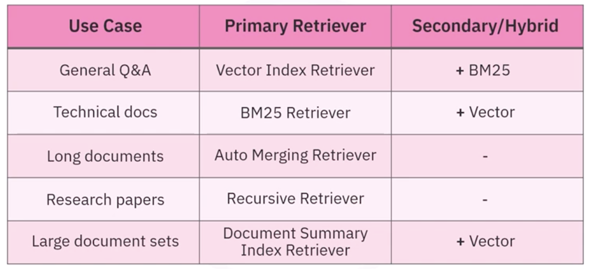

## Inroduction
- multi-query
- self querying
- parent doument retrievers

## Advance retrivers in LlangChain
- A Llangchain retriever is an interface that returns a document based on an unstructured query

- Vector store-based
    - retrive document from a vector store
        - Similarity based retrieval
        - Maximum marginal relevance (MMR) based retrieval
            - select documents based on 2 creiterien
                - Maximum relevance to the query
                - Minimum similar to the previously seleted docuemnt
                - balance the relevance and diversity
### Multi-Query Retriever
- uses LLM to create different versions of the querz to generate a richer set of documents
- overcomes
    - differences in results due to changes in query wording
    - difference due to poor emebddings

```python
from langchain.retrievers.multi_query import MultiQueryRetriever
retriever = MultiQueryRetriever.from_llm(
    retreiver=vectordb.as_retreiver(),
    llm0llm()
)
docs = retriver.invoke("email policy")
```

### Self query retiriever
- can use meta data to retrieve the documents
- it convert query into 2 parts
    - string to look up semantically
    - metadata filter to go along with that

```python
document_content_description = "Brief summary of a Movie"
retiever = SelfQueryRetriever.from_llm(
    llm(),
    vectordb,
    document_content_description,
    metadata_field_info
)
retriever,invoke("I wnat to watch a moie rated higher than 8.5")
```
### Parent Document Retreiver
- splitting docuements involves conflicts between small document for accuracz and long document for context
- Parent Document Retriever fetches small chunks and look up their parent IDs, reuturn large documents of the small chunks

```python
from langchain.retrievers import ParentDocumentRetiever
from langcahin_text_splitters import CharacterTextSplitter
from langchain.storage import InMemoryStore

partent_splitter = CharacterSplitter(
    chunk_size=2000, chunk_overlap=20, seperator="\n"
)
child_splitter = CharacterSplitter(
    chunk_size=400, chunk_overlap=20, seperator="\n"
)

vectordb = Chroma(
    collection_name="split_parents", 
    embedding_function=embedding_function
)

# storage for parent documents
store = InMemoryStore()

retriever = ParentDocumentRetriever(
    vectorstore=vectordb,
    docstore=store,
    child_splitter=child_splitter,
    parent_splitter=parent_splitter
)

## to add document to the collections
retriever.add_documents(data)

## to retreive documents
retiever.invoke("smoking policy")
```
- the ParentDocuemntRetriever will return the documents from the parent document not from the child


## Advanced Retrievers in LlamaIndex

### VectorStoreIndex
- Semantic search based on meaning
- Stores embddings for each document chunk
- beast suited for semantic retrieval
- common in llm pipelines


### DocumentSummaryIndex
- Generate summaries to identify relevant documents
- generate the summaries of docuemnts while indexing
- filters documents sbefore full retrival
- cusefule for large diverse document sets that can't fit in the context window of the LLM
- Advantages
    - use summaries to filter the document
    - 2 versions
        - LLM based
            - time consuming
            - expensive
        - Embedding based
            - used semantic similarity
            - efficient for large collections
- the retriever retuns the docuemnts not their summary


### KeywordTableIndex
### KeywordTableIndex
Extract keyword matching for rule-based or hybrid search
- this index exracts keywords form the documents
- enable exact keyword mactching
- maps keywords to specific chunks of context
- Useful for hybrid or rule-based search

### TF-IDF
- TF: measures how often a keyword appear in a docuemnt
- IDF: How rare the word is in the complete docuemnt
- TF-IDF score is the product of these values
    - TFIDF = TF * IDF
    - highlight the words that are common in the document however rare in the collection

#### BM25 Retriever
- Keyword-based retriver
- retreive content based on exact keyword match, not on semantic similarity

### Auto Merging Retriever
- presver the context in long doc using a hierarchical structure
- break the document into parent and chield nodes
- return parent node if enough child nodes matches
- consolidates related context and preserves broad context

### Recursive Retriever
- Follow node relationship using references
- it can follow
    - Citations and Metadata links
- support chunks and metadata references
- Retrives content accross documents of abstraction layers

### QueryFusion Retriever
- combine results form multiple different retrivers
- can geneate multiple querys usign LLMs to improve coverage
- Fusion stragegies
    - Resiprocal Rank Fussion
        - ranking docuemnts
        - 
    - Relative Score Fussion
        - Normalize score within each result set
    - Distribution-Based Fusion
        - use statistical 
        
### Retriever recommendations

