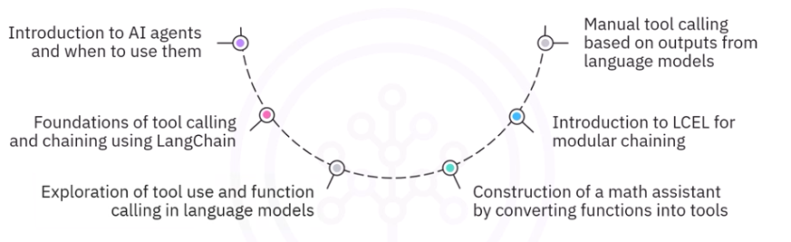
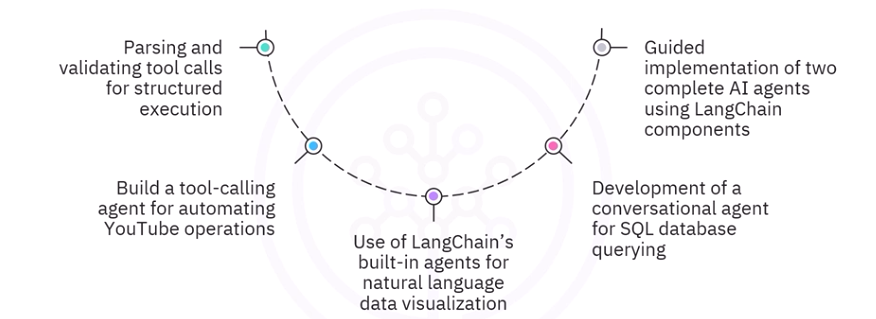

## Overview
- How LLMs can use external tools
- LCEL (LangChain Expression Language)

### Objectives
- AI agents invokes tools
- tool calling and chaining to create structured workflows
- Use build-in agents to analyze data, generate visualization and execute database queries
- best practises in prompt engineering and tool orchestration to enhance AI agent performance

### Module 1
- Lesson 0: Welcome
- Lesson 1: Introduction to AI Agents
- Lesson 2:  Getting Started with Tool Calling 
- Lesson 3: Building and Orchestrating Tools
- Lesson 4: Module Summary and Evaluation  

#### Key topics
- Function calling for LLMs
- AI Agents and Tool Orchestration

### Module 2
- Lesson 1: Introduction to Chaining and LCEL Basics
- Lesson 2: Manual Tool Calling Basics
- Lesson 3: Parsing and Validating Tool Calls  
- Lesson 4: Module Summary and Evaluation  

#### Key topics
- LangChain Expression Language (LCEL)
- Manual Tool Invocation 
- Structured Outputs for Tool Calls 
- Parsing and Validating LL

### Module 3
- Lesson 1: Natural Language Data Visualization 
- Lesson 2: Conversational Database Access
- Lesson 3: Module Summary and Evaluation
- Lesson 4: Course Wrap-Up

#### Key topics
- Built-in LangChain Agents 
- Natural Language to Data Visualizations 
- AI-Powered SQL Agents

### Tools and Softwares
- LangChain: To design and implement structured AI workflows, orchestrate large language models (LLMs) with external tools, and build intelligent agents. 
- LangChain Expression Language (LCEL): For building custom chains and flexible, production-ready AI workflows. 
- Large Language Models (LLMs): To experiment with different AI models, understand their capabilities, and integrate them into agent applications. 
- LangGraph: To serve as an extension for building advanced agents with LangChain.
- Python: For coding AI applications, defining custom tools, integrating APIs, and implementing LangChain’s functionalities effectively. 
- LangChain’s Built-in Agents (e.g., DataFrame Agent and SQL Agent): For natural language data analysis, visualization, and conversational database access.

## Content

