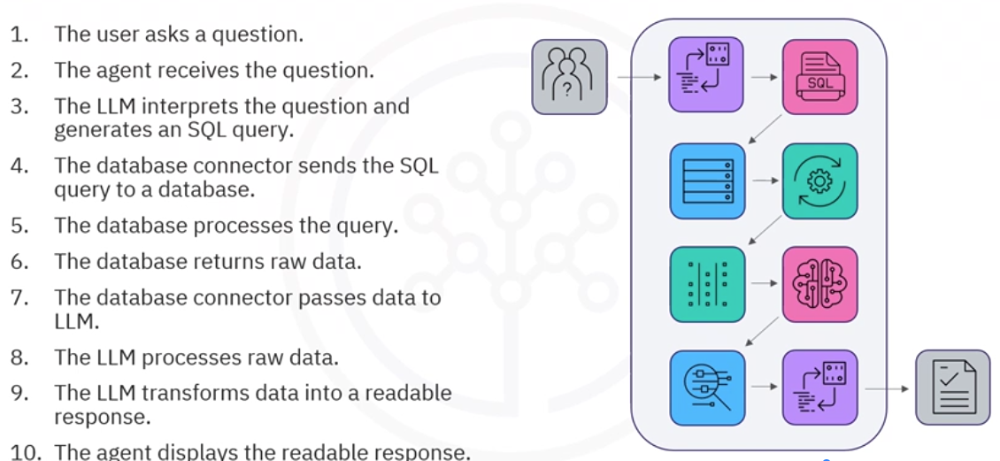

## Pandas Dataframe Agent
- special agent in Langchain to do natural langauge querying and visaulization on pandas dataframe
- experimental module
- not suitable for production environments

```python
# load llm
llm = ...

# load dataframe
df = pd.read_csv(...)

from from langchain_experimental.agents.agent_toolkits import create_pandas_dataframe_agent

agent = create_pandas_dataframe_agent(
    llm,
    df,
    verbose=False,
    return_intermediate_steps=True,  # set return_intermediate_steps=True so that model could return code that it comes up with to generate the chart
    handle_parsing_errors=True
)

response = agent.invoke("how many rows of data are in this file?")

# to find the model generated code
# - need to set the return_intermediate_step = True
print(response['intermediate_steps'][-1][0].tool_input.replace('; ', '\n'))
```

## SQL Agent
- Database operations
    - read and undertand database schemas
    - Retrieves schemas only from relevant 
- Query management
    - support multi-step querying
    - query fails
        - captures error
        - analyze tracebacks
        - retries the task using corrected 
- Limitations of SQL agnets
    - may not be accurate
    - complex queries require manual adjustments
    - continous testing and validation are essential
- Query process

