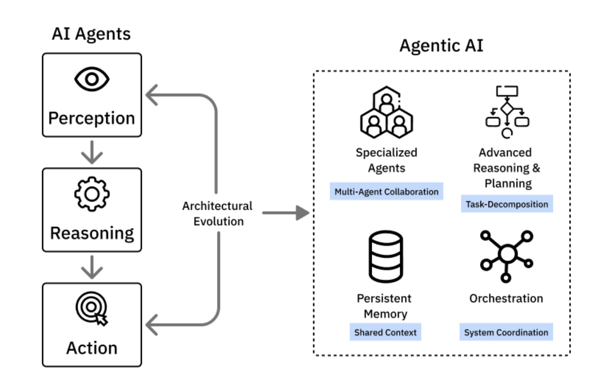

## Overview
- Agentic workflows with **LangChain** and **LangGraph**
- LangGraph
    - memory
    - iteration 
    - conditional logic
- How LangGraph builds on LangChain to support adatptive decision-making using nodes, edges, and shared states.

- **Self-improving agents**
    - using architetures like
        - Reflection
        - Reflexion
        - ReAct

- cordinate agents in multi-agent systems
    - Agentic retrieval-augmented generation (RAG) pipelines

### Course outline
- Module 1: Introduction to LangGraph
    - Agentic AI fundamentals
    - LangGraph workflows
    - LangGraph nodes, edges, and state
- Module 2: Build self-improving Agents with LangGraph
    - self-improving agents
    - Reflection and Reflexion patterns
    - ReAct for resoning and action
    - Prompt engineering techniques
- Module 3: Multi-Agent Systems and Agentic RAG with LangGraph
    - Multi-agent systems
    - Agent orchestration
    - Agentic RAG pipelines
    - Query routing and retrieval

## Generative vs Agentic AI
- Generative AI
    - Reactive systems  (will generte only after a user **prompt**)
        - can generate (text, image, code, or audio)
        - However, the system stops after the generation process

- Agentic AI
    - Proactive systems
        - start with user prompt, however, the generation not stops after the first generatnion
        - prompt -> a series of actions
        - the life cycle of actions
            - the system presives the job in hand -> it decides what to do -> it execute one task -> it learns what task it has completed -> repeat the cycle
            - the process is with minimal human intervention

- use cases

|Generative AI| Agentic AI|
|---|---|
|**createive content creation**: a youtuber can outline a topic on his next video using generative ai models, or to generate a background music|an example can be a personal purchase agent  (multi step process) - hunt for products in multiple platforms  - it process checkout   - it cordinates delivery   seek input from human only when it needed|

- Agentic AI using the LLMs as the **Resoning agent** for agentic process
- **Chain of Thought Reasoning**

### Agentic AI
- Agentic AI refers to systems made up of multiple (single) agents that work tougther. they can
    - breakdown big goals into smaller tasks
    - Adapt to new inputs or situations
    - communicate and cordinate with one another

- **AI Agent** vs **Agentic AI**
    - **AI Agents** chracterised by autonomous software tools desigened for goal-directed task execution. The operation involves 3 caipabilites,
        - **Autonomy**
            - function with minimal human intervention
            - caipable of preceving environmental inputs
            - resoning over contextual data
            - executing actions in real-time
        - **Task-Specificity**
            - agent is optimized for narrow well defined task
                - email filtering, database querying etc
        -**Reactivity**
            - respond to intput from users, APIs, or other software environments in realtime.

    - **Agentic AI**
        - Agentic AI tasks things further to AI Agents
            - brings multiple agents into a team
            - agents cordinate tasks, exchange information, adapt roles dynamically, and share memory
            - Key features
                - Task decomposition: goals split into subtasks automatically
                - Inter-Agent Communication: share updates and results via shared memory or messaging
                - Memory and reflection: remember past steps and learn from outcomes
                - Orchestration: a lead agent or system coordiantes the team

    |Feature|AI Agent|Agentic AI|
    |---|---|---|
    |Design|One agent, one task|Multiple agents with distictive roles|
    |Communication|No cordination with others|Constant communication and coordination|
    |Memory|Stateless or minimal history|Persistent memory of tasks, and stategies|
    |Resoning|Linear logic (do step A -> B)|iterative planning and re-planning with advanced reasoning|
    |Scalability|Limited to task size|Can scale to handle mulit-agent, multi-stage problems|
    |Typical Applications|chatbots, virtual assistans, workflow helpers|Supply chain coordination, enterprose optimiztaion, virtual team leaders|

#### Advanced Resoning Capabilites
- integrate advanced resoning capabilites using frameworks such as
    - ReAct
    - Chain-of-Thought Prompting
    - Tree of Thoughts
- these mechanisms helps the agents to breakdown the goal into multiple tasks, evaluate intermediate steps, and re-plan actions dynamically.

### Persistent memory systems
- memory subsystem to preserve and persist knowledge accross cycles or agent sessions
- Memory types include
    - episodic memory: task specific history
    - semantic memory: long term facts or structured data
    - vector based memory: for RAG

### Applications
- AI Agents
    - customer support
    - Internal enterprise search
    - Email filtering and prioritization

- Agentic AI
    - multi-agent search assistent
    - Roboritic cordination (eg. drones)
    - collaborative medical decision sytems
    - Adaptive workflow automation

#### Agentic AI complexities
- inter-agent error cascades
- cordination breakdowns
- scalability limits 
- explainability issues coming from orchestraing multiple agents

#### Emerging solutions
- RAG: to address halusination
- Tool-augemented reasoning
- Memory architechure: persisting information accross tasks. Episodic memory allow to recall previous tasks and feedbacks

### Agentic AI tools and Frameworks
- **LangChain**
    - to build application around LLM
    - support tool usage, memory, chain of reasoning, and agent interfaces
- **LangGraph**
    - Multi-agent workflows using graph-based execution model.
    - allows to deinfe agents as nodes and their interaction as edges
    - ideal for orchestrating collaborative agens in Agentic AI.
- **IBM Bee, CrewAI, AutoGen, and others**
    - open source tools 
    - simplifies the design of multi-agent team, role assignment, and structured task planning
    - allow develpers to simulate or deploy collaborative agent environment using memory, messaging, and dynamic delegation