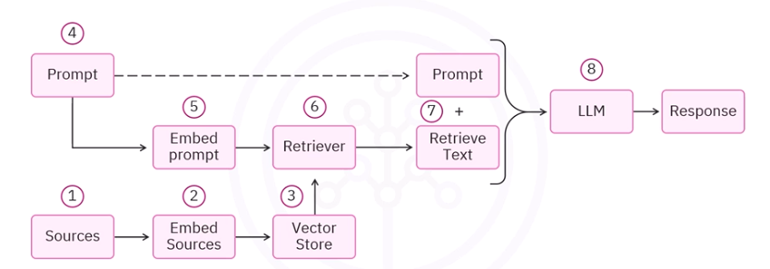

## Llama Index
- framework for building LLM powered context augmentation
    - context augmentation = making data available to LLM
    - Allow LLM to perfrom a task while grounding the LLM's response in the provided context
    - examples 
        - Question-Answering with RAG
        - Chatbots (extend RAG pipleine with followup questions/clarifications)
        - Document undertanding and data extraction
            - LLM idetifies names, datase, adresses etc from large amount of structured and unstructured data

## RAG diagram


## Rag Process in Llama Index
### Loading source documents
- LlamaIndex `Document` class
- from a variety of sources
    - txt, pdf, csv, json, html
    - and various connectors and cloud sources 

```python
from llama_index.core import Document
my_document = Document(text="Hello LlamaIndex")
mydocument.dict()
```

- the result has some key comp (output of .dict() method)
    - id: a unique identifier
    - embedding: if the whold doc is embedded
    - metadata: we can give metadata
        - such as origin or date of creation
    - relationship: links the doc to other docs
    - text: information in the 
    
### Reading document from a folder
- `SimpleDirectoryReader` class
```python
from llama_index.core import SimpleDierectoryReader

# load all the files in my_folder
documents = SimpleDirectoryReader("my_folder").load_data()

# load folder with all subdirectories
documents = SimpleDirectoryReader("my_folder", recursive=True).load_data()

# load specific files
documents = SimpleDirectoryReader(
    input_files = ["my_folder/sample_text.txt"]
).load_data()

# to load specific file types only
documents = SimpleDirectoryReader(
    input_directory = "my_folder",
    required_exts=[".txt", ".csv"]
).load_data()
```
- the `SimpleDirectoryReader` outputs a list of `Documents` class

### Splitting (Chunking) text
- LlamaIndex `nodes` are simple text chunks
- `SenteceSplitter` class
- SenteceSplitter split the text based on various character like `new line character` or `spaces`
```python
from llama_index.core.node_parser import SentenceSplitter

node_parser = SenteceSplitter(chunk_size=1024, chunk_overlap=20)

nodes = node_parser.get_nodes_from_docuemtns(
    documents,
    show_progress = False
)
```
- node_index returns a list of LlamaIndex TextNode instences, which are similar in structure to Document instances

- LlamaIndex prvodes other splitters too
    - **SentenceSimilaritySplitter**: split text if the sence similary falls below some threshold
    - **A wrapper around any LangChain splitter**
