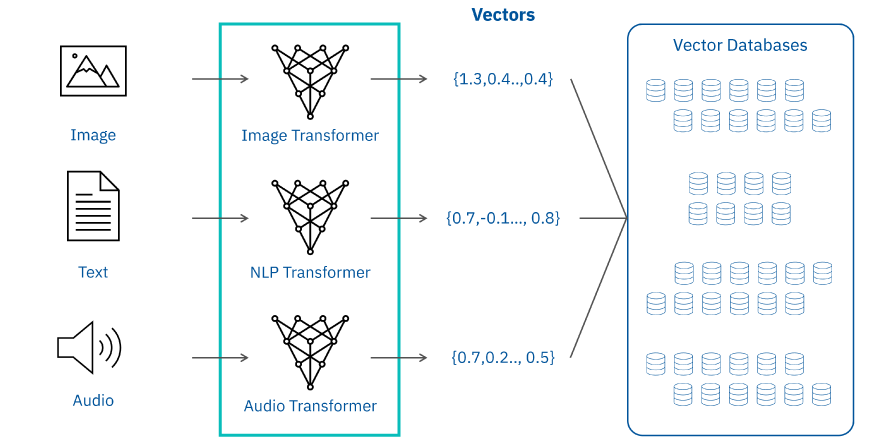
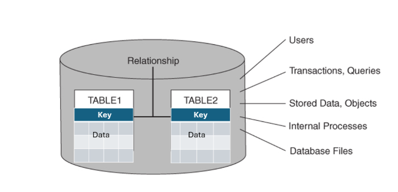
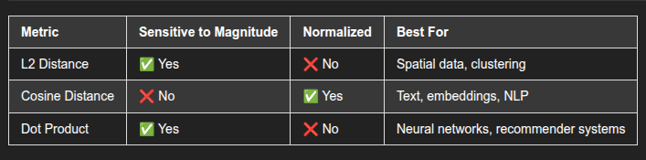

## Vector Databases
- to store and query vectorized data raipidly
- data as vectors in multi-dimentional space
- vectors encapsulate essential attributes of the items they represent
- useful for
    - similarity search
    - nearest neighbours queries
    - assessing distance/similarity between vectors

### Vector database and data storage
- vector db stores vectors, depict each data item.
- each number signifies various attributes or featuers of the object
- the image depicts how these vectors are formed

### Vector libraries
- in memory vector databases
- vector dbs use pre-configured algoritms to store and update data
- the vector dbs have full CRUD (reate, read, update and delete) capabilities

## Relationship databases
- organize data into rows and columns
- SQL
- managing structured data (relationships are well-defined)

### data storage
- data in tables, each data point respresets a distinct entry or relationship
- row: record, column: a property or attribute
- tables connect each other using  keys (main and foreign)
    - **main key**: the unique identifier in a table (not null, once assigned will not change)
    - **foreign key**: record in a table that point to the main key in another table

- manipulate the rows and columns using
    - SELECT, INSERT, UPDATE, DELETE operations

## Comparision between relationship and vector dbs
|Function|Traditional databases|Vector databases|
|---|---|---|
|Data Representation|Traditional databases organize data in a structured format using tables, rows, and columns, ideal for relational data.|Vector databases represent data as multi-dimensional vectors, efficiently encoding complex and unstructured data like images, text, and sensor data.|
|Data Search and Retrieval|SQL queries are suited for traditional databases with structured data.|Vector databases specialize in similarity searches and retrieving vectorized data, facilitating tasks like image retrieval, recommendation systems, and anomaly detection.|
|Indexing|Traditional databases employ indexing methods like B-trees for efficient data retrieval.|Vector databases use indexing structures like metric trees and hashing suited for high-dimensional spaces, enhancing nearest-neighbor searches and similarity assessments.|
|Scaleability|Scaling traditional databases can be challenging, often requiring resource augmentation or data sharding.|Vector databases are designed for scalability, especially in handling large datasets and similarity searches, using distributed architectures for horizontal scaling.|
|Applications|Traditional databases are pivotal in business applications and transactional systems where structured data is processed.|Vector databases shine in analyzing vast datasets, supporting fields like scientific research, natural language processing, and multimedia analysis.|

## Vector DB types
- In Memory: Store vectors directly in Memory
    - Enable fast read and write
        - realtime analytics and recommendation systems
    - vendors: RedisAI & Torchserve

- Disk-based vector databases
    - stores vectors on disk
    - Suitable for large data sets (Memory is not enough to hold the data)
    - complex compression and retrieval techniques for speed and storing efficiency
    - examples: Annoy, Milvus, ScaNN

- Distributed vector databases
    - spread across multiple nodes (servers)
    - horizontal scaling and fault tolerance
    - suitable fo r massive data sets and high-throughput tasks
    - FAISS, Elasticserach with Vector Plugin, Dask-ML

- Graph-based vector databases
    - model data as graph
    - nodes and edges represnet vector attributes or embeddings
    - excel at capturing complex relationships
    - Facilitate graph analytics
    - Neo4j, Amazon Neptune, TigerGraph

- Time-series vector databases
    - data collected over time as vectors
    - useful for analyzing temporal patterns and anomalies
    - InfluxDB, TimescaleDB & Prometheus

- Dedicated Vector databases
    - Uses special characterstics to store, index, query, and analyze vector data
    - provides efficiency for similaritz search, clustering and classification tasks.
    - Special characterstics
        - use unique data structures
            - Reversed index
            - Product quantization
            - Locality-sensitive hashing (LSH)
        - support vector operations
            - Nearest neighbour search
            - similarity search
            - distance calculations
        - Provide Scalability
            - Store and querz big vector data sets quickly across clusters or distributed systems
        - Deliver speed
            - optimized algorithms and data structures to get quick answers
        - Provide customization
            - Change database paramters for indexing and searching (diff operations effectively)
        - popular dedicated databases
            - Faiss: Facebook AI Similarity Search
            - Annoy: Approximate Nearest Neighbors Oh Yeah
            - Milvus

    - Databases that support vector search
        - regular database systems
        - data processing frameworks
        - these 2 databases support query vector data
        - store vector data as
            - Binary Large Objects
            - Arrays
            - User-defined types (UDTs)
        - may not be optimized as dedicated vector databases

## Application of Vector Databases

### Image and video analysis
|Task|Vector database capability|Uses|
|---|---|---|
|Perform Feture extraction and representation|Store high-dimentional feature vectors|Displays aspectks of images, such as colour histogram, testure description, or learning embeddings|
|Simiarity search|Store feature vectors|Locate images, summariye videos, and suggest images and videos based on content|
|Process real-time data|Provide horizontal scalability for real-time data storage|Perform video surveillance, object recognition, and live event analysis|

- example
    - in a photo sharing app, when you add a new image of your, it compares the image with the existing images in its database. 
    - if the photo matches with other photos then it recommends other similar photos to make an album or tag

### Recommendation systems

|Task|Vector database caipability|Uses|
|Embedding storage and nearest neighbor search|stores embeddings or numerical representation of items generated by the recommendation system|Locate the vectors closest nightbors for improving personaliyed suggestions|
|Performance imporvement and scalability|- provide scalability to handle searches   - Imporve query processing and indexing structure|Deliver fast, scalable recommentaion service for large number of concurrent users|
|Provide cross domain suggestions|carry out cross domain suggestions|Enhance the completness of the recommendation systems|

- for example
    - a streaming service can keep the embeddings of movies in a vector database
    - it can recomment moves based on the movie watched by the customers
    - based on similarity

## Similarity 
- L2 Distance
- Cosine Distance
- Dot Product
### Choosing the right Metirc

